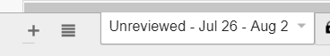
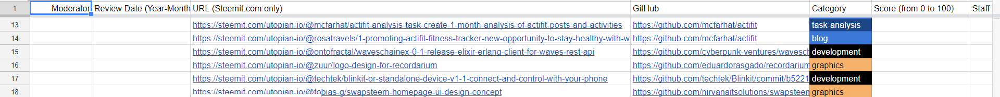

# General Moderator Workflow and Guidelines

Welcome here! This document aims to provide the most necessary steps for you to be on track while being a Utopian.io moderator.

## Policies and guidelines

Don't forget to check Utopian [policies and category-specific guidelines][ut-guidelines] so that you are familiar with the updated version. If any point is not understandable, contact your team and your group leader, who can help you with understanding it. The easiest and fastest way is to communicate in the [Utopian Discord][ut-discord] server, where moderators have their channels dedicated to everything related to the moderation.

## Moderation Workflow

All valid contributions are fetched by a script into a dedicated sheet for the team members to see quickly and can work with them. This sheet is used until a moderation panel is implemented in a Utopian frontend.

Access to this document is limited only to the Utopian team. Therefore, when you become a moderator, you will be given a link to this document, and you will need to ask for write permissions.

### The review sheet

Once you have access to the sheet, you will see several spreadsheets. The only spreadsheet that is important for your needs as a moderator is the first one (unless the order is changed :D) with the names **Unreviewed - {{ review_week }}**. The review week goes from Thursday to Thursday; the name is regularly adjusted to have the name of the current review week.

The review sheet contains several columns to insert the required data.

| Column | Note |
|-|-|
| Moderator | The Steem username of the moderator |
| Review Date | The date of the review done. The format is in YYYY-MM-DD |
| URL | The Steemit URL of the post |
| GitHub | The URL of the GitHub repository |
| Score | Score on range [0, 100]. Use <http://review.utopian.io> to get the score |
| Staff Picked | Flag to staff pick a contribution. **CMs only** |
| Staff Pick Date | The date of the staff pick. The format is in YYYY-MM-DD. **CMs only** |
| Staff Picked By | The Steem username of the CM who picked the contribution. **CMs only** |
| Voted | Flag whether a post was voted, pending, unvoted, etc. **Don't edit this cell** |
| Voting | Calculated vote for the post. **Don't edit this cell** |

You can see that the relevant cells for moderators are Moderator, Review Date, Score. You can skip other cells unless you see a glaring error with the data or missing pieces you could fill.

### Scoring

Every moderator is supposed to use a predefined questionnaire to lead the review. However, the quality questionnaire is only the minimum; it is essential to write a detailed and clear comment for contributors so that they can learn from mistakes and they can feel that their work is useful.

You should take the score from the [review page][ut-review-page]. If you see that the resulting score does not fit the actual quality and the provided work of the contributor, consult it with the Community Manager. Don't act on your own and don't change anything without CM knowing.

Score 0 should be given only in obvious cases:

- the post is not relevant to the Utopian aim
- the post is not about an open source project
- the author violated Utopian policies or repeatedly violated the [guidelines][ut-guidelines] and ignored any feedback on improvement
- it is evident that the submission is only for earning money; don't forget that money should not be the main reason to work on a project
- the submission is of a very low quality that Utopian should not support
- the submission was published by a banned user

### Staff Picks

A staff picked contribution will get the highest vote possible in the category. Staff picks are the examples of outstanding contributions and posts submitted to Utopian.

If you see a contribution worth to be picked and rewarded with the highest vote, **talk to the Community Manager before you fill the cells in the review sheet**. It is important. If you report a staff-pick-worth submission late, the contribution will not have a chance to get a higher reward.

## Banned users

Sometimes, you may face a situation that a user who violated the Utopian policies and guidelines several times, they are rude to the moderation team and other members of the Utopian community.

In such cases, you should report the user to the Community Manager. We prepared a summary of general cases and violations a user can make and the duration of the penalty if they do so. More details on the ban policies and duration can be found in [here](bans.md).

[ut-guidelines]: https://join.utopian.io/guidelines
[ut-discord]: https://discord.gg/8E4pwuW
[ut-review-page]: http://review.utopian.io
